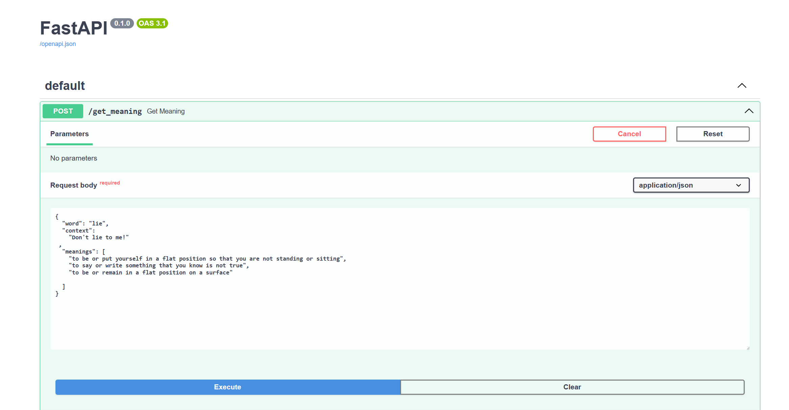

# Решение задачи WSD при помощи текстового трансформера + API (Проектная деятельность, Московский политех)


### Использование
1) Если хотите использовать GPU, установите pytorch  командой `pip3 install torch torchvision torchaudio --index-url https://download.pytorch.org/whl/cu118`, иначе пропустите это шаг
2) Установите зависимости из файла requirements.txt
3) Запустите uvicorn web server при помощи команды `uvicorn wsdAPI.`
4) Перейдите на http://127.0.0.1:8000/docs (или ваш адрес и порт, если изменяли адресс по умолчанию) (или на прямую отправляйте запросы на эндпоинт через что то типо постмана)



Можете протестировать один из следующих вариантов, или придумать свой 

```
{
  "word": "lie",
  "context": 
    "Don't lie to me!"
 ,
  "meanings": [
    "to be or put yourself in a flat position so that you are not standing or sitting",
    "to say or write something that you know is not true",
    "to be or remain in a flat position on a surface"
    
  ]
}


{
  "word": "python",
  "context":
    "Instead, Python code is executed line by line, which makes it easier for programmers to test and debug their programs. Its simplicity and dynamic typing also make it an excellent choice for beginners, as it allows for rapid development and prototyping."
  ,
  "meanings": [
    "a large tropical snake that kills animals for food by winding its long body tightly around them",
    "a versatile and popular high-level programming language known for its simplicity and readability"
  ]
}


{
  "word": "rich",
  "context":
    "The chocolate orange fondant was too rich for me."
  ,
  "meanings": [
    "having a lot of money or property",
    "containing a lot of fat, butter, eggs, etc. and making you feel full quickly"
  ]
}
```